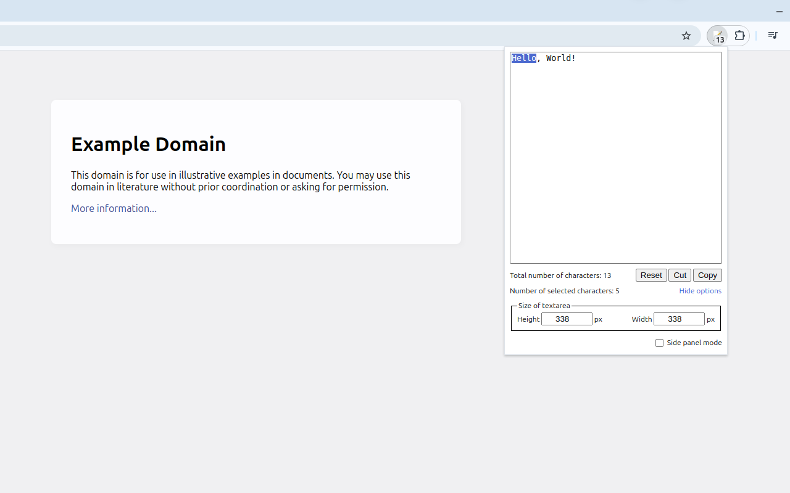
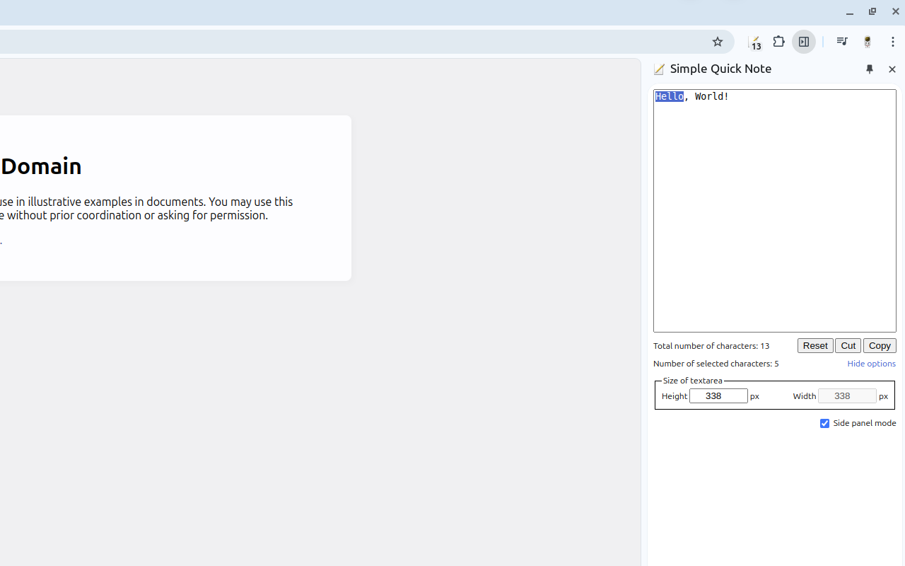

# [Simple Quick Note](https://chromewebstore.google.com/detail/jiabjkckgapmaalmfbjdkcbkpiafnfga)

- [Chrome Web Store](https://chromewebstore.google.com/detail/jiabjkckgapmaalmfbjdkcbkpiafnfga)
- [Installation for developers (for Linux users)](#installation-for-developers-for-linux-users)
- [Sources](#sources)
    - [Icons](#icons)

## Installation for developers (for Linux users)

1. Go to the `chrome://extensions`.
2. Enable `Developer mode` checkbox.
3. Click on the `Load unpacked` button.
4. Select the extension directory.

## Sources

### Icons

- [Action edit Icon](https://iconarchive.com/show/crystal-clear-icons-by-everaldo/action-edit-icon.html)
